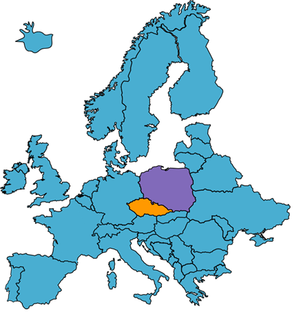
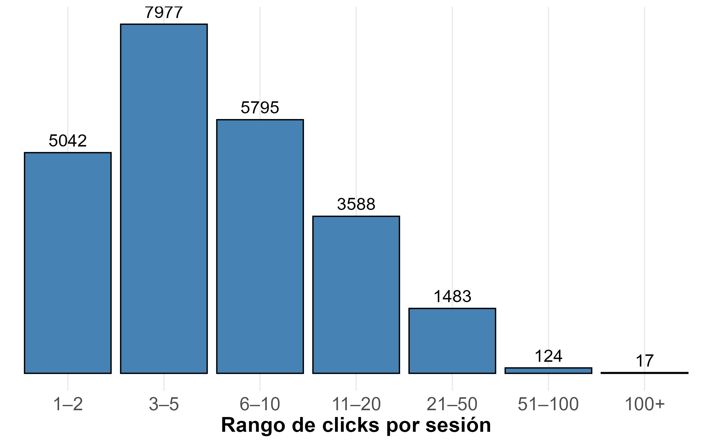
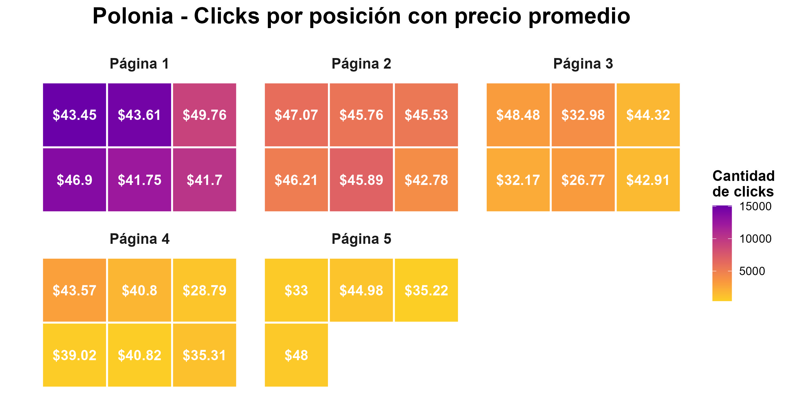
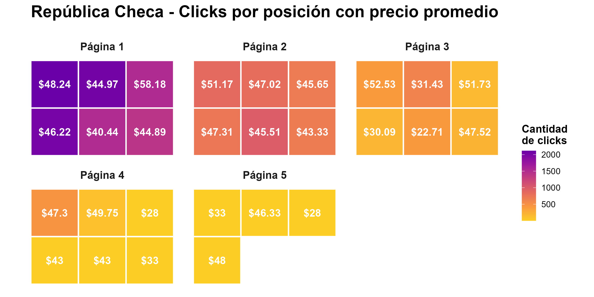
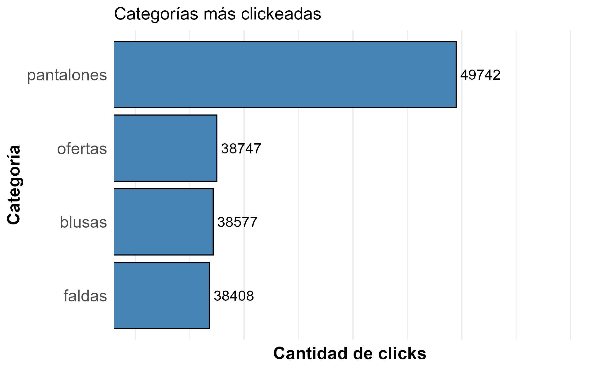

<h1 align="center">🛍️ Análisis de comportamiento de clientes en E-Shop</h1>

> [!NOTE]
> **Objetivo del proyecto:** Analizar los patrones de comportamiento y navegación de usuarios en una e-shop polaca de ropa para embarazadas.
> El objetivo es identificar productos clave, recomendaciones basadas en reglas de asociación y secuencias de navegación para optimizar la estrategia comercial y la experiencia del cliente.

---

<h2 align="center">🛠 Tecnologías utilizadas</h2>

  
  
  
  
  

---

    
📦 Estructura general del análisis

✅ Análisis exploratorio de sesiones y productos
✅ Distribución de clicks por país, página y posición de imagen
✅ Identificación de productos más populares y categorías destacadas
✅ Descubrimiento de reglas de asociación (frequent itemsets y reglas)
✅ Descubrimiento de secuencias frecuentes de navegación (cspade)

---

## 🌍 Dataset utilizado

Datos extraídos del archivo **e-shop clothing 2008** (publicado en 2013), correspondiente a un e-shop polaco especializado en ropa para embarazadas.

    
📄 Variables incluidas

- **session_id**: identificador único de la sesión de cada usuario.
- **year, month, day**: fecha en que se realizó el click.
- **order**: orden de cada click dentro de la sesión (1 para el primer click, 2 para el segundo, etc.).
- **product_code**: código del producto visto.
- **main_category**: categoría principal del producto.
- **country**: país de origen de la IP del usuario.
- **price**: precio del producto mostrado.
- **page**: número de página en el sitio (del 1 al 5).
- **location**: posición de la imagen en la página (por ejemplo, top left, bottom middle, etc.).

> ℹ️ Además, el dataset contiene otras variables descriptivas que no fueron incluidas en este resumen. Para más detalles podés revisar el archivo **e-shop clothing 2008 data description.txt** disponible en este repositorio.

---

> ℹ️ Para más detalles podés revisar el archivo **e-shop clothing 2008 data description.txt** disponible en este repositorio.

  
📄 ¿Cuál fue el análisis y/o descubrimiento que obtuvimos?

<h2>🔎 Exploración inicial</h2>

- **¿De dónde son los clientes?**
- **¿Dónde miran exactamente?**
- **¿Qué miran en concreto?**

### 🗺️ Usuarios

- Las visitas al e-commerce se concentran en **Polonia** (81%), seguido de **República Checa** (10%).
- Otros países suman en conjunto solo un 9%.

  

### 🛒 ¿Qué tanto se mantienen los usuarios en la página?

- La mayoría de los usuarios da entre **3 y 5 clics**.
- Un grupo pequeño da más de **51 clics**, probablemente explorando todo en detalle.

  

### 👀 Foco de atención en la página principal

- Los usuarios concentran la atención en la **esquina superior izquierda**.
- Los productos más caros podrían ubicarse allí estratégicamente.
- La mayoría no pasa de la página 2 o 3.

  

En República Checa, el foco es aún más claro, lo que confirma la tendencia:

  

### 👗 Categorías más vistas

- La categoría **pantalones** domina ampliamente.

  

---

<h2>🔁 Análisis de reglas de asociación</h2>

- Se analizan reglas por país, filtradas en la categoría de pantalones.
- **Explicado de forma sencilla**: si un cliente elige un producto (antecedente), ¿qué tan probable es que vea otro (consecuente)?

#### 🇵🇱 Polonia

<table>
  <tr>
    <th>Si ve...</th>
    <th>Entonces ve...</th>
    <th>Soporte</th>
    <th>Confianza</th>
    <th>Lift</th>
  </tr>
  <tr>
    <td>C57</td>
    <td>C56</td>
    <td>2,16%</td>
    <td>34,27%</td>
    <td>3,77</td>
  </tr>
  <tr>
    <td>C17</td>
    <td>C12</td>
    <td>2,97%</td>
    <td>22,93%</td>
    <td>2,91</td>
  </tr>
  <tr>
    <td>C2</td>
    <td>C1</td>
    <td>2,02%</td>
    <td>22,29%</td>
    <td>2,37</td>
  </tr>
</table>

#### 🇨🇿 República Checa

<table>
  <tr>
    <th>Si ve...</th>
    <th>Entonces ve...</th>
    <th>Soporte</th>
    <th>Confianza</th>
    <th>Lift</th>
  </tr>
  <tr>
    <td>C49</td>
    <td>C50</td>
    <td>4,95%</td>
    <td>41,67%</td>
    <td>4,14</td>
  </tr>
  <tr>
    <td>C40</td>
    <td>C29</td>
    <td>4,38%</td>
    <td>35,10%</td>
    <td>4,09</td>
  </tr>
  <tr>
    <td>C57</td>
    <td>C56</td>
    <td>5,12%</td>
    <td>42,76%</td>
    <td>2,91</td>
  </tr>
</table>

---

<h2>🔀 Análisis de secuencias: ¿En qué orden ven los productos?</h2>

- **Producto A2** aparece con mucha frecuencia en las rutas, indicando su importancia como "gancho".
- Ideal para recomendaciones dinámicas:
  - Usuario ve A1 → sugerir A2.
  - Usuario ve A2 → sugerir A5, A3 o A11.

#### Secuencias más frecuentes

<table>
  <tr>
    <th>Secuencia</th>
    <th>Soporte</th>
  </tr>
  <tr>
    <td>A2 → A5</td>
    <td>3,08%</td>
  </tr>
  <tr>
    <td>A1 → A2</td>
    <td>3,06%</td>
  </tr>
  <tr>
    <td>A2 → A3</td>
    <td>2,93%</td>
  </tr>
  <tr>
    <td>A2 → A11</td>
    <td>2,58%</td>
  </tr>
</table>

---

<h2>🖼️ Conclusiones</h2>

- **REUBICACIÓN**
  - Productos caros → "top left".
  - Destacar A2 en página principal.
- **SISTEMA DE RECOMENDACIONES**
  - A1 → sugerir A2.
  - A2 → sugerir A5, A3, A11.
- **PERSONALIZACIÓN POR PAÍS**
  - Polonia: C57 → C56.
  - Rep. Checa: C49 → C50.
- **OPTIMIZACIÓN DE PÁGINAS**
  - Productos importantes en páginas 1 y 2.
- **A2 COMO PRODUCTO “GANCHO”**
  - Promociones especiales.
  - Landing pages centradas en A2.

---

<h2>👨‍💻 Autores</h2>

  <table>
    <tr>
      <td align="center">
        <a href="https://www.linkedin.com/in/adriel-starchevich" target="_blank">
           
          
        </a>
      </td>
     <td align="center">
        <a href="https://www.linkedin.com/in/c-elias-3a8065307/" target="_blank">
           
          
        </a>
     </td>
    </tr>
  </table>

## 📄 Citación

Łapczyński M., Białowąs S. (2013). *Discovering Patterns of Users' Behaviour in an E-shop — Comparison of Consumer Buying Behaviours in Poland and Other European Countries*, Studia Ekonomiczne, nr 151, *La société de l'information : perspective européenne et globale : les usages et les risques d'Internet pour les citoyens et les consommateurs*, pp. 144–153.

