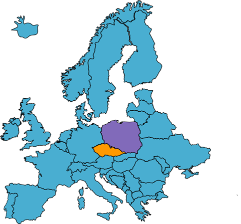

<h1 align="center">🛍️ Análisis de comportamiento de clientes en E-Shop</h1>

> [!NOTE]
> **Objetivo del proyecto:** Analizar los patrones de comportamiento y navegación de usuarios en una e-shop polaca de ropa para embarazadas.
> El objetivo es identificar productos clave, recomendaciones basadas en reglas de asociación y secuencias de navegación para optimizar la estrategia comercial y la experiencia del cliente.

---

<h2 align="center">🛠️ Tecnologías y librerías</h2>

  
  
  

---

<h2>📦 Estructura general del análisis</h2>

- 🕵️ **Exploración inicial**
- 🌎 **Distribución geográfica**
- 👀 **Foco de atención en la página**
- ⭐ **Productos y categorías más populares**
- 🔗 **Reglas de asociación**
- 🔁 **Análisis de secuencias**

---

<h2> 📄 ¿Cuál fue el análisis y/o descubrimiento que obtuvimos? </h2>

  
💬 Haz click para ver el detalle completo

<h3>🔎 Exploración inicial</h3>

- **¿De dónde son los clientes?**
- **¿Dónde miran exactamente?**
- **¿Qué miran en concreto?**

---

<h3>🗺️ Usuarios </h3>

- Las visitas al e-commerce se concentran en **Polonia** (81%), seguido de **República Checa** (10%).
- También hay desde otras partes del mundo, pero en conjunto solo suman el 9% de las visitas totales.

  

---

<h3> 🛒 ¿Qué tanto se mantienen los usuarios en la página? </h3>

- La mayoría de los usuarios da entre **3 y 5 clics**.
- La minoría da más de **51 clics**, este último grupo puede darse por gente que revisa de pie a cabeza la página buscando las ofertas.

  

---

<h3> 👀 Foco de atención en la página principal </h3>

- Los usuarios concentran la atención en la **esquina superior izquierda**.
- Además de que podrían ubicar mejor los productos (productos más caros en la zona más clickeada).
- La mayoría no pasa de la página 2 o 3.

  

- En el siguiente gráfico está más marcado el foco de atención, además de demostrar que no es una coincidencia:

  

---

<h3> 👗 Categorías más vistas </h3>

- Lo más visto es la categoría de **pantalones**... interesante, no?

  

---

<h3>🔁 Análisis de reglas de asociación</h3>

- Se analizan reglas por país, filtradas en la categoría de pantalones.
- **Explicado de forma sencilla**: si un cliente elige un producto (antecedente), ¿qué tan probable es que vea otro (consecuente)?

#### 🇵🇱 Polonia

    <table>
    <tr>
        <th>Si ve...</th>
        <th>Entonces ve...</th>
        <th>Soporte</th>
        <th>Confianza</th>
        <th>Lift</th>
    </tr>
    <tr>
        <td>C57</td>
        <td>C56</td>
        <td>2,16%</td>
        <td>34,27%</td>
        <td>3,77</td>
    </tr>
    <tr>
        <td>C17</td>
        <td>C12</td>
        <td>2,97%</td>
        <td>22,93%</td>
        <td>2,91</td>
    </tr>
    <tr>
        <td>C2</td>
        <td>C1</td>
        <td>2,02%</td>
        <td>22,29%</td>
        <td>2,37</td>
    </tr>
    </table>

#### 🇨🇿 República Checa

    <table>
    <tr>
        <th>Si ve...</th>
        <th>Entonces ve...</th>
        <th>Soporte</th>
        <th>Confianza</th>
        <th>Lift</th>
    </tr>
    <tr>
        <td>C49</td>
        <td>C50</td>
        <td>4,95%</td>
        <td>41,67%</td>
        <td>4,14</td>
    </tr>
    <tr>
        <td>C40</td>
        <td>C29</td>
        <td>4,38%</td>
        <td>35,10%</td>
        <td>4,09</td>
    </tr>
    <tr>
        <td>C57</td>
        <td>C56</td>
        <td>5,12%</td>
        <td>42,76%</td>
        <td>2,91</td>
    </tr>
    </table>

---

<h3>🔀 Análisis de secuencias: ¿En qué orden ven los productos?</h3>

- Podemos ver un patron claro, **A2** aparece **BASTANTE**. Esto significa que no solo es popular individualmente sino que también se ve junto con otros productos.
- Esto es **IMPORTANTE** para las recomendaciones en tiempo real:
  - Usuario ve A1 → sugerir A2.
  - Usuario ve A2 → sugerir A5, A3 o A11.

#### Secuencias más frecuentes

    <table>
    <tr>
        <th>Secuencia</th>
        <th>Soporte</th>
    </tr>
    <tr>
        <td>A2 → A5</td>
        <td>3,08%</td>
    </tr>
    <tr>
        <td>A1 → A2</td>
        <td>3,06%</td>
    </tr>
    <tr>
        <td>A2 → A3</td>
        <td>2,93%</td>
    </tr>
    <tr>
        <td>A2 → A11</td>
        <td>2,58%</td>
    </tr>
    </table>

---

<h3>🖼️ Conclusiones</h3>

- **REUBICACIÓN**
  - Productos caros → "top left".
  - Destacar A2 en página principal.
- **SISTEMA DE RECOMENDACIONES**
  - A1 → sugerir A2.
  - A2 → sugerir A5, A3, A11.
- **PERSONALIZACIÓN POR PAÍS**
  - Polonia: C57 → C56.
  - Rep. Checa: C49 → C50.
- **OPTIMIZACIÓN DE PÁGINAS**
  - Productos importantes en páginas 1 y 2.
- **A2 COMO PRODUCTO “GANCHO”**
  - Promociones especiales.
  - Landing pages centradas en A2.

---

<h2 align="center">👨‍💻 Autores</h2>

  <table>
    <tr>
       <td align="center">
        <a href="https://www.linkedin.com/in/adriel-starchevich" target="_blank">
           
          
        </a>
      </td>
      <td align="center">
        <a href="https://www.linkedin.com/in/c-elias-3a8065307/" target="_blank">
           
          
        </a>
      </td>
    </tr>
  </table>

---

<h3> 🌍 Dataset utilizado </h3>

Datos extraídos del archivo **e-shop clothing 2008** (publicado en 2013), correspondiente a un e-shop polaco especializado en ropa para embarazadas.

> ℹ️ Para más detalles sobre las variables, podés revisar el archivo **e-shop clothing 2008 data description.txt** disponible en este repositorio.